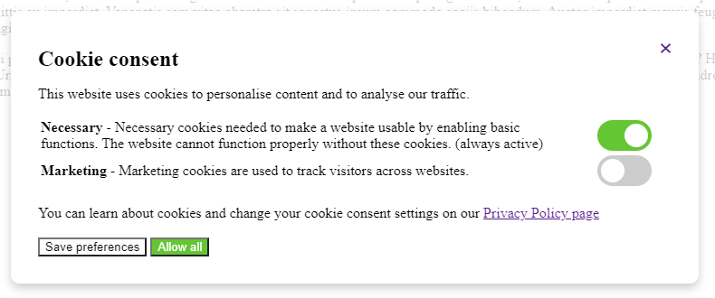
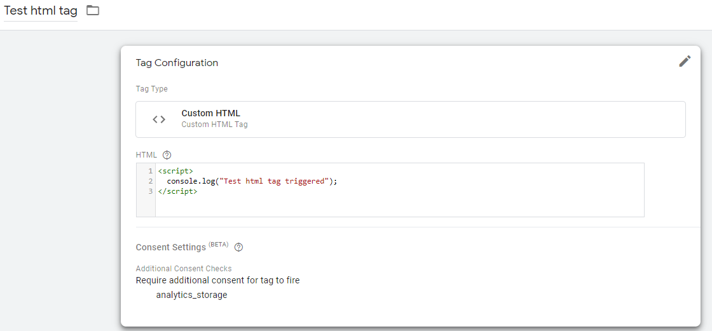
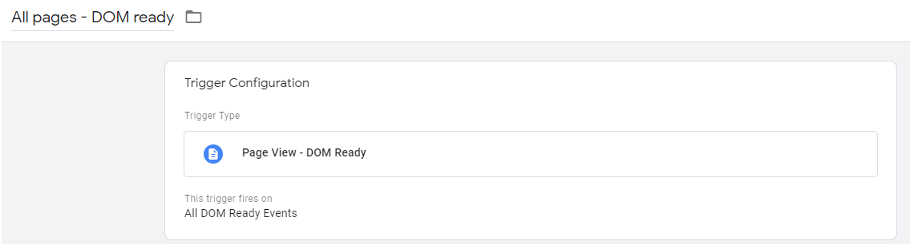
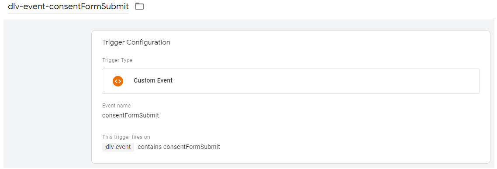
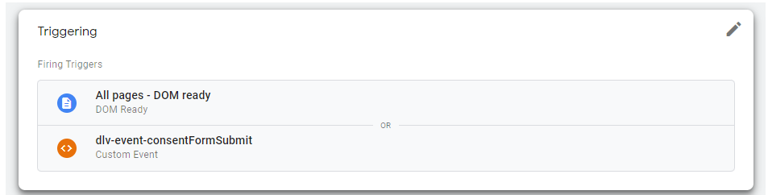

# Simple GDPR opt-in cookie consent using HTML, CSS, Javascript and jQuery

Example of simple Cookie Consent dialog with page overlay that allows user to set cookie preferences. 



The user choices are saved to cookie with 1 year expiration. Link or button can by used to reopen the dialog and change user preferences by setting the element class "showCookieDialog"

Javascript for Cookie Consent dialog: [src/cookieConsent.js](/src/cookieConsent.js)<br>
HTML for Cookie Consent dialog: [src/cookieConsent.html](/src/cookieConsent.html)<br>
CSS for Cookie Consent dialog: [src/style.html](/src/style.html)<br>
One page example: [src/index.html](/src/index.html)<br>

## Google Tag Manager consent settings
Example contains Google Tag Manager definition with default consent denied that gets updated based on user settings.
```javascript
 // Default consent settings
gtag('consent', 'default', {'functionality_storage': 'granted',
                            'security_storage': 'granted',
                            'ad_storage': 'denied', 
                            'analytics_storage': 'denied',
                            'personalization_storage': 'denied',
                            'wait_for_update': 500}); // so you can update consent later and it gets correctly triggered in GTM
```
The default settings waits 500 milliseconds before being pushed to data layer so it can be updated based on user settings.
```javascript
if (currentPreferences["marketing"] == 1) {
    gtag('consent', 'update', {
                    'ad_storage': 'granted', 
                    'analytics_storage': 'granted',
                    'personalization_storage': 'granted'});
} else if (currentPreferences["marketing"] == 0) {
    gtag('consent', 'update', {
                    'ad_storage': 'denied', 
                    'analytics_storage': 'denied',
                    'personalization_storage': 'denied'});
}
```
This triggers tags correctly if Cookie Consent preferences are already saved but does not trigger tags when user saves preferences using consent dialog for the first time (because it takes more than 500 milliseconds). To trigger tags after saving preferences using Cookie Consent dialog a custom event is pushed to data layer that can be used to trigger them without reloading the page.
```javascript
triggerGTMEvent('consentFormSubmit');
// push GTM event to data layer
function triggerGTMEvent(eventName) {
    window.dataLayer.push({
        'event' : eventName
    });
}
```

## GTM tag and triggers configuration example
Tag with specified additional consent requirement (some types of tags have this requirement set up by default)



"Page View - DOM Ready" event has to be used as default trigger ("Page View" trigger will not fire the tag because at the time "Page View" is triggered the consent is set to denied)



Trigger with custom event is used to trigger tag after Cookie Consent form is saved 



Both triggers are used for event so it is correctly fired after page load (in case user already saved cookie preferences) or after setting preferences using Cookie Consent dialog.




## Sources
Sources for Google Tag Manager settings:
- https://developers.google.com/tag-platform/devguides/consent
- https://support.google.com/analytics/answer/9976101?hl=en

Source for nice switch slider: 
- https://www.w3schools.com/howto/howto_css_switch.asp